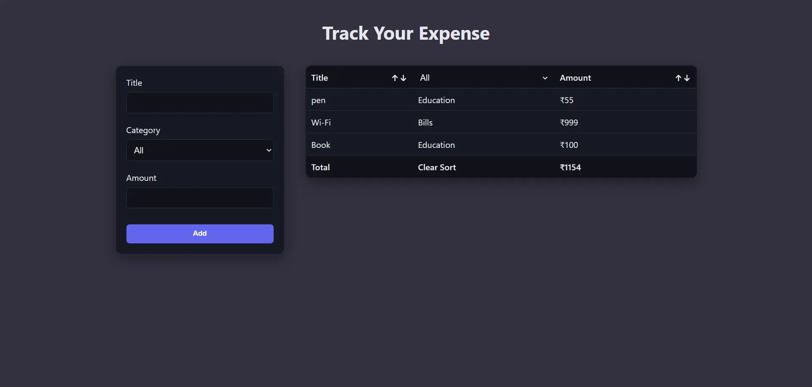

# 💰 Expense Tracker

A modern and interactive expense tracking application built with React and TypeScript.
It allows users to manage daily expenses with a clean UI, real-time updates, and persistent storage.

---

## 📸 Preview

<p align="center">
  
</p>

---

## 🚀 Features

* ➕ Add, edit, and delete expenses
* 🔍 Filter expenses by category
* 🔃 Sort expenses (title / amount)
* 💾 Persistent data using `localStorage`
* 🧠 Form validation with real-time error feedback
* 🖱️ Context menu for quick actions (edit / delete)
* ⚡ Instant UI updates with React state

---

## 🛠️ Tech Stack

* **React** – Component-based UI architecture
* **TypeScript** – Type safety and better developer experience
* **CSS3** – Custom styling with responsive design
* **Custom Hooks** – Reusable logic (`useLocalStorage`, `useFilter`)

---

## 🧩 Architecture Highlights

* Strongly typed components, props, and state
* Generic custom hooks for reusable logic
* Clean separation of form state and stored data
* Controlled components for form handling
* Safe handling of nullable and dynamic state

---

## ⚙️ Getting Started

### 1. Clone the repository

```bash id="c1m8z2"
git clone https://github.com/port-iamniraj/Expense-Tracker.git
cd expense-tracker
```

### 2. Install dependencies

```bash id="p9v3x7"
npm install
```

### 3. Run development server

```bash id="u4k7t1"
npm run dev
```

### 4. Build for production

```bash id="s6n2q5"
npm run build
```

---

## 🌐 Live Demo

> https://port-iamniraj.github.io/Expense-Tracker/

---

## 📌 Key Concepts Implemented

* Generic hooks with TypeScript
* Strict typing for forms and events
* Controlled inputs with validation
* Dynamic UI updates based on state
* Safe localStorage handling

---

## 🔮 Future Improvements

* 📊 Expense analytics and charts
* 🌙 Dark/light theme toggle
* 📁 Export data (CSV / PDF)
* 🔐 Authentication & cloud sync
* 📱 Improved mobile experience
